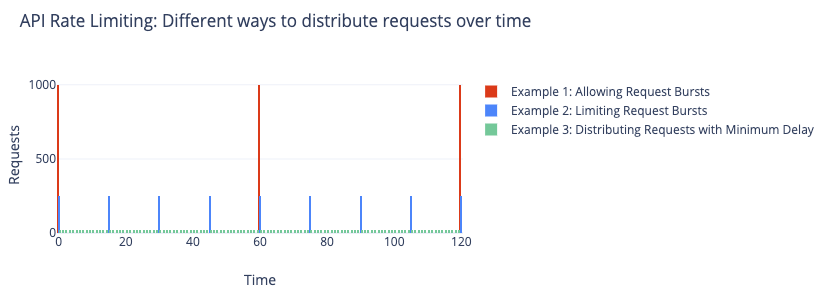

# Capacity Limiter


A powerful, flexible task scheduler and rate limiter based on resource capacity.
Efficiently manage task execution in JavaScript and TypeScript applications.

## Use Cases

- **API Rate Limiting**: Respect API quota limits by scheduling requests within capacity - [See examples](#api-rate-limiting)
- **Resource Intensive Operations**: Manage memory or CPU usage for heavy computations - [See examples](#cpu-bound-task-management)
- **Database Connection Pooling**: Control number of concurrent database operations
- **Worker Queues**: Manage task throughput based on worker capacity
- **Network Request Management**: Throttle network requests to avoid overload
- **Batch Processing**: Control parallelism for optimal resource usage - [See example](#memory-constrained-processing)

## Features

- **Capacity-Based Task Scheduling**: Control resource usage with user-defined capacity units
- **Priority Queueing**: Prioritize important tasks when resources are limited
- **Flexible Task Configuration**: Fully configurable tasks with timeout, priority, and capacity options
- **Rich Queue Management**: Control queue size and behavior when capacity is exceeded
- **Customizable Capacity Strategies**: Choose between `reserve` (temporary) and `claim` (lasting) capacity usage
- **Built-in Timeout Handling**: Automatically handle execution timeouts and queue waiting timeouts
- **Retry and Recovery**: Sophisticated retry strategies for failed tasks
- **Release Rules**: Configure automated capacity release with time-based rules
- **Comprehensive TypeScript Support**: Fully typed with detailed type definitions

## Installation

```bash
npm install capacity-limiter
# or
yarn add capacity-limiter
# or
pnpm add capacity-limiter
```

## Quick Start

Example: API Rate Limiter

```typescript
import { CapacityLimiter } from 'capacity-limiter';

// Using claim strategy and reset rule to handle APIs with a quota that resets every minute
const burstLimiter = new CapacityLimiter({
    maxCapacity: 1000,             // API allows 1000 requests per minute
    capacityStrategy: 'claim',     // Each request permanently claims capacity
    releaseRules: [
        { type: 'reset', interval: 60 * 1000 } // Reset capacity to 0 every minute
    ]
});

// Make API requests through the limiter
async function makeApiRequest(endpoint, data) {
    return burstLimiter.schedule(1, async () => {
        const response = await fetch(endpoint, {
            method: 'POST',
            body: JSON.stringify(data),
            headers: { 'Content-Type': 'application/json' }
        });
        return response.json();
    });
}
```

More examples can be found in the [Real-World Examples](#real-world-examples) section.

## Core Concepts

### Capacity

Capacity represents abstract resource units (CPU, memory, network, etc.) that tasks consume.
You define what a unit means in your context - it could be memory in MB, API requests, database connections, etc.
You can also use `maxConcurrent` and `minDelayBetweenTasks` as a replacement or addition to capacity-based management.

### Task Scheduling

Tasks are scheduled with a specified capacity requirement.
If there's enough available capacity, tasks execute immediately.
Otherwise, they're queued until capacity becomes available.

### Capacity Strategies

- **Reserve**: Capacity is temporarily reserved during task execution and released afterward (default)
- **Claim**: Capacity is claimed and remains used after task completion (useful for allocations)

### Queue Size Exceeded Strategies

When `maxQueueSize` is set and exceeded, the limiter uses one of these strategies:

- **throw-error**: Reject new tasks with a `CapacityLimiterError` when the queue is full (default)
- **replace**: Remove the oldest task from the queue to make room for the new task
- **replace-by-priority**: Compare priorities and replace the lowest priority task in the queue if the new task has higher priority

### Task Exceeds Max Capacity Strategies

When a task requires more capacity than `maxCapacity`:

- **throw-error**: Reject the task immediately with a `CapacityLimiterError` (default)
- **wait-for-full-capacity**: Allow the task to be scheduled, but wait until all capacity is available (zero used capacity) before executing it

## Advanced Usage

### Object-Style Configuration

```typescript
const result = await limiter.schedule({
  task: async () => {
    // Your task implementation
    return 'task result';
  },
  capacity: 5,         // Amount of capacity required
  priority: 1,         // Priority (0-9, lower is higher priority)
  queueWaitingLimit: 1000,   // Prioritize after waiting 1000ms
  queueWaitingTimeout: 2000, // Fail if waiting over 2000ms in queue
  executionTimeout: 3000,    // Fail if execution takes over 3000ms
});
```

### Release Rules

```typescript
const limiter = new CapacityLimiter({
  maxCapacity: 100,
  capacityStrategy: 'claim',
  releaseRules: [
    // Reset capacity to zero every hour
    { type: 'reset', interval: 60 * 60 * 1000 },
    // Reduce capacity by 10 units every minute
    { type: 'reduce', value: 10, interval: 60 * 1000 },
  ],
});
```

### Retry Strategies

```typescript
const simpleRetryLimiter = new CapacityLimiter({
  maxCapacity: 10,
  failRecoveryStrategy: 'retry',
});

const configuredRetryLimiter = new CapacityLimiter({
  maxCapacity: 10,
  failRecoveryStrategy: {
      type: 'retry',
      retries: 3, // Number of retries
      minTimeout: 1000, // Minimum timeout between retries
      maxTimeout: 5000, // Maximum timeout between retries
      randomize: true, // Randomize the timeout between min and max
      factor: 2, // Exponential backoff factor
  },
});

const customRetryLimiter = new CapacityLimiter({
  maxCapacity: 10,
  failRecoveryStrategy: {
      type: 'custom',
      retry: async (error, attempt) => {
          // Custom retry logic
          if (String(error).includes('Rate limit exceeded') && attempt < 3) {
              console.log(`Retrying... Attempt ${attempt}`);
              return {
                  type: 'retry',
                  timeout: 1000 * Math.pow(2, attempt), // Exponential backoff
              };
          }
          // Do not retry
          return {
              type: 'throw-error',
              error
          };
      },
  },
});
```

### Queue Management

```typescript
// Set queue size limit and behavior
const limiter = new CapacityLimiter({
  maxCapacity: 10,
  maxQueueSize: 100,  // Limit queue to 100 tasks
  queueSizeExceededStrategy: 'replace-by-priority', // Strategy when queue is full
  
  // Optional timeouts for queued tasks
  queueWaitingLimit: 500,    // Tasks waiting over 500ms get highest priority
  queueWaitingTimeout: 5000, // Tasks waiting over 5000ms are rejected
});

// Handle task capacity exceeding max capacity
const bigTaskLimiter = new CapacityLimiter({
  maxCapacity: 10,
  taskExceedsMaxCapacityStrategy: 'wait-for-full-capacity', // Wait for all capacity to be free
});
```

### Stopping the Limiter

```typescript
// Wait for all tasks to complete
await limiter.stop();

// Reject waiting tasks but allow executing tasks to complete
await limiter.stop({ stopWaitingTasks: true });

// Reject all tasks, including those currently executing
await limiter.stop({ stopWaitingTasks: true, rejectExecutingTasks: true });
```

## API Reference

### `CapacityLimiter`

```typescript
constructor(options: CapacityLimiterOptions)
```

#### Options

| Option | Type | Default | Description |
|--------|------|---------|-------------|
| `maxCapacity` | `number` | (optional) | Maximum capacity that can be used |
| `initiallyUsedCapacity` | `number` | `0` | Initial capacity already in use |
| `capacityStrategy` | `'reserve' \| 'claim'` | `'reserve'` | How capacity is managed |
| `releaseRules` | `ReleaseRule[]` | `[]` | Rules for releasing capacity |
| `taskExceedsMaxCapacityStrategy` | `'throw-error' \| 'wait-for-full-capacity'` | `'throw-error'` | Strategy when task exceeds max capacity |
| `maxConcurrent` | `number` | (unlimited) | Maximum concurrent tasks |
| `maxQueueSize` | `number` | (unlimited) | Maximum queue size |
| `queueSizeExceededStrategy` | `'throw-error' \| 'replace' \| 'replace-by-priority'` | `'throw-error'` | Strategy when queue size is exceeded |
| `queueWaitingLimit` | `number` | (unlimited) | Max queue waiting time before prioritization |
| `queueWaitingTimeout` | `number` | (unlimited) | Max queue waiting time before failure |
| `executionTimeout` | `number` | (unlimited) | Max execution time |
| `minDelayBetweenTasks` | `number` | (no delay) | Minimum time between task executions in milliseconds |
| `failRecoveryStrategy` | `FailRecoveryStrategy` | `'none'` | Strategy for recovering from failures |

### Methods

#### `schedule`

```typescript
// Basic scheduling with default capacity
schedule<TResult>(callback: () => Promise<TResult>): Promise<TResult>;

// Scheduling with specified capacity
schedule<TResult>(capacity: number, callback: () => Promise<TResult>): Promise<TResult>;

// Scheduling with full configuration
schedule<TResult>(params: TaskParams<TResult>): Promise<TResult>;
```

#### Other Methods

```typescript
// Get current options
getOptions(): CapacityLimiterOptions;

// Set/update options
setOptions(options: CapacityLimiterOptions): void;

// Get current used capacity
getUsedCapacity(): Promise<number>;

// Set used capacity
setUsedCapacity(usedCapacity: number): Promise<void>;

// Adjust used capacity relatively.
// Positive values increase used capacity.
// Negative values release capacity.
adjustUsedCapacity(diff: number): Promise<void>;

// Stop the limiter
stop(params?: StopParams): Promise<void>;
```

## Real-World Examples

Jump to:
- [Example 1: Allowing Request Bursts](#example-1-allowing-request-bursts-1000-requestsminute)
- [Example 2: Limiting Request Bursts](#example-2-limiting-request-bursts)
- [Example 3: Distributing Requests with Minimum Delay](#example-3-distributing-requests-with-minimum-delay)
- [Example 4: Sequential Requests with No Overlap](#example-4-sequential-requests-with-no-overlap)
- [CPU-Bound Task Management](#cpu-bound-task-management)
- [Memory-Constrained Processing](#memory-constrained-processing)

### API Rate Limiting



The way you handle API rate limiting depends on the API's behavior and your requirements.

1. If the API allows bursts of requests and resets the quota every minute,
   you can use a `claim` strategy with a `reset` rule to handle it for maximum efficiency.
2. If the API allows bursts, but you want to limit them to avoid overloading the server,
   you can use a `claim` strategy with a `reduce` rule to spread requests evenly.
3. If the API doesn't handle bursts well,
   you can use a `minDelayBetweenTasks` to enforce a minimum delay between requests.
4. If you want to ensure that requests are executed sequentially without overlap,
   you can combine `minDelayBetweenTasks` with `maxConcurrent` set to 1.

#### Example 1: Allowing Request Bursts (1000 requests/minute)

```typescript
import { CapacityLimiter } from 'capacity-limiter';

// Using claim strategy and reset rule to handle APIs with a quota that resets every minute
const burstLimiter = new CapacityLimiter({
  maxCapacity: 1000,             // API allows 1000 requests per minute
  capacityStrategy: 'claim',     // Each request permanently claims capacity
  releaseRules: [
    { type: 'reset', interval: 60 * 1000 } // Reset capacity to 0 every minute
  ]
});

// Make API requests through the limiter
async function makeApiRequest(endpoint, data) {
  return burstLimiter.schedule(1, async () => {
    const response = await fetch(endpoint, {
      method: 'POST',
      body: JSON.stringify(data),
      headers: { 'Content-Type': 'application/json' }
    });
    return response.json();
  });
}
```

#### Example 2: Limiting Request Bursts

```typescript
import { CapacityLimiter } from 'capacity-limiter';

// Rate limit: 1000 requests per minute
const REQUESTS_PER_MINUTE = 1000;
const RELEASE_INTERVAL_MS = 15 * 1000; // Release capacity every 15 seconds

// Using claim strategy and reduce rule to limit bursts and spread requests
const smoothLimiter = new CapacityLimiter({
  maxCapacity: REQUESTS_PER_MINUTE,
  capacityStrategy: 'claim',
  releaseRules: [
    // Release (REQUESTS_PER_MINUTE / (60 * 1000 / RELEASE_INTERVAL_MS)) capacity every interval
    { 
      type: 'reduce', 
      value: REQUESTS_PER_MINUTE / (60 * 1000 / RELEASE_INTERVAL_MS),
      interval: RELEASE_INTERVAL_MS 
    }
  ]
});

// This approach prevents bursts from using all capacity at once
// and spreads requests more evenly throughout the minute
```

#### Example 3: Distributing Requests with Minimum Delay

```typescript
import { CapacityLimiter } from 'capacity-limiter';

// Rate limit: 1000 requests per minute
const REQUESTS_PER_MINUTE = 1000;
const MIN_DELAY_MS = (60 * 1000) / REQUESTS_PER_MINUTE; // 60ms between requests

// Using minDelayBetweenTasks to enforce a minimum time between requests
const delayLimiter = new CapacityLimiter({
  minDelayBetweenTasks: MIN_DELAY_MS
});

// This spreads out requests evenly, but allows multiple requests to 
// execute concurrently if they take longer than minDelayBetweenTasks
```

#### Example 4: Sequential Requests with No Overlap

```typescript
import { CapacityLimiter } from 'capacity-limiter';

// Rate limit: 1000 requests per minute
const REQUESTS_PER_MINUTE = 1000;
const MIN_DELAY_MS = (60 * 1000) / REQUESTS_PER_MINUTE; // 60ms between requests

// Combining minDelayBetweenTasks with maxConcurrent to prevent overlapping requests
const sequentialLimiter = new CapacityLimiter({
  minDelayBetweenTasks: MIN_DELAY_MS,
  maxConcurrent: 1              // Only one request can execute at a time
});

// This guarantees that requests never overlap and are spaced at least 
// 60ms apart, regardless of how long each request takes to complete
```

### CPU-Bound Task Management

```typescript
import os from 'os';
import { CapacityLimiter } from 'capacity-limiter';

const cpuLimiter = new CapacityLimiter({
  maxConcurrent: os.cpus().length, // Use available CPU cores
});

// Process items utilizing available CPU cores
async function processItems(items) {
  return Promise.all(
    items.map(item => 
      cpuLimiter.schedule(async () => {
        // CPU-intensive work here
        return heavyComputation(item);
      })
    )
  );
}
```

### Memory-Constrained Processing

```typescript
// Limit memory usage for processing large files
const memoryLimiter = new CapacityLimiter({
  maxCapacity: 500,             // Limit to 500MB of memory usage
});

// Process files with file size determining capacity requirements
async function processFile(filePath) {
  const stats = await fs.promises.stat(filePath);
  const fileSizeMB = stats.size / (1024 * 1024);
  
  return memoryLimiter.schedule(fileSizeMB, async () => {
    // Read and process file
    const data = await fs.promises.readFile(filePath);
    return processData(data);
  });
}
```

## Contributing

Contributions are welcome! Please feel free to submit a Pull Request.

1. Fork the repository
2. Create your feature branch (`git checkout -b feature/amazing-feature`)
3. Commit your changes (`git commit -m 'Add some amazing feature'`)
4. Push to the branch (`git push origin feature/amazing-feature`)
5. Open a Pull Request

## License

This project is licensed under the MIT License - see the LICENSE file for details.

## Support

If you find this package helpful, consider [sponsoring the author](https://github.com/sponsors/mdevils) or [becoming a patron](https://patreon.com/mdevils).
